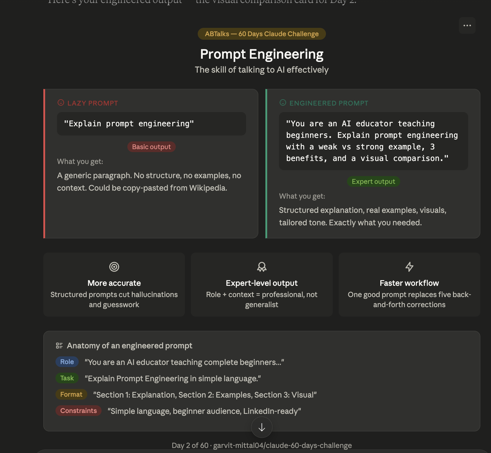

# Day 2 — What Is Prompt Engineering

**Challenge:** 60 Days of AI
**Date:** June 2, 2026
**Difficulty:** Beginner | **Time:** ~30 min

---

## What I Learned

Prompt Engineering is writing smart, structured prompts to get more accurate answers, better creativity, expert-level outputs, and faster workflows.

## Lazy Prompt vs Engineered Prompt

| | Lazy Prompt | Engineered Prompt |
|--|-------------|-------------------|
| Input | "Explain prompt engineering" | Role + Task + Format + Constraints |
| Output | Generic paragraph | Structured, expert-level response |
| Quality | Basic | Professional |

## Anatomy of a Good Prompt
- **Role** — tell Claude who to be
- **Task** — what you need done
- **Format** — how to structure the output
- **Constraints** — tone, audience, length

## 3 Key Benefits
1. More accurate answers — less hallucination
2. Expert-level output — role + context = professional response
3. Faster workflow — one good prompt replaces five corrections

## Tool of the Day
**MetaPrompt** Chrome Extension — rewrites rough prompts into structured ones with one click inside Claude.

---

*Part of my [60 Days of AI Challenge](../README.md)*
