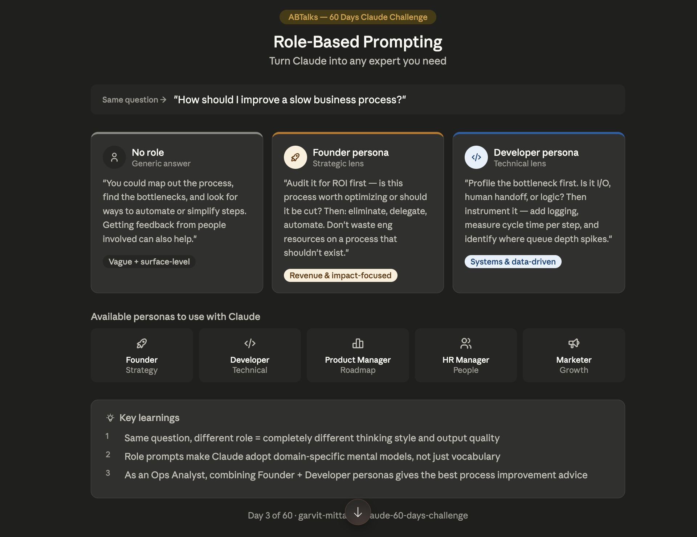

# Day 3 — Role-Based Prompting

**Challenge:** 60 Days of AI
**Date:** June 3, 2026
**Difficulty:** Beginner | **Time:** ~35 min

---

## What I Learned

Role-Based Prompting means assigning Claude a specific persona before asking a question. Instead of generic answers, you get responses from the perspective of a domain expert.

## The Experiment

**Question asked:** "How should I improve a slow business process?"

| Prompt Type | Response Style | Quality |
|-------------|---------------|---------|
| No role | Vague, surface-level | Generic |
| Founder persona | Strategic, ROI-focused | Targeted |
| Developer persona | Technical, data-driven | Specialized |

## Prompts Used

**No role:**
> "How should I improve a slow business process?"

**Founder persona:**
> "You are an experienced startup Founder. How should I improve a slow business process?"

**Developer persona:**
> "You are a senior software Developer. How should I improve a slow business process?"

## Key Learnings
1. Same question + different role = completely different thinking style
2. Role prompts make Claude adopt domain-specific mental models
3. Combining Founder + Developer personas gives the best ops advice

## Available Personas
- Founder → strategy & ROI
- Developer → systems & data
- Product Manager → roadmap & prioritization
- HR Manager → people & culture
- Marketer → growth & messaging

## Tool of the Day
**Claude Usage Counter** — Chrome extension that tracks message consumption and remaining quota in real-time.

---

*Part of my [60 Days of AI Challenge](../README.md)*
