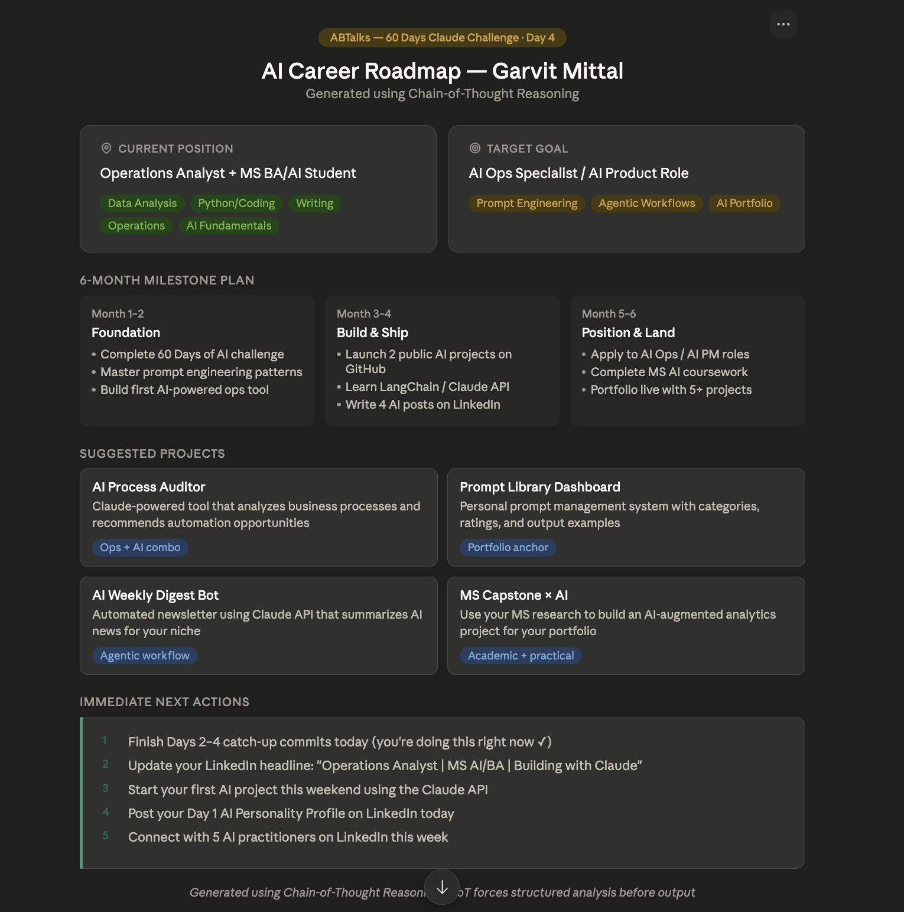

# Day 4 — Chain-of-Thought Prompting

**Challenge:** 60 Days of AI
**Date:** June 4, 2026
**Difficulty:** Beginner | **Time:** ~40 min

---

## What I Learned

Chain-of-Thought (CoT) Prompting forces Claude to reason step-by-step before answering. Instead of jumping to a conclusion, it breaks down the problem, analyzes it, and builds a structured output.

## The CoT Prompt I Used 
You are an Elite AI Career Strategist.
Your goal is to build a personalized roadmap for me.
Before creating the roadmap, ask me ONLY these 4 questions...
Think step by step.
## My 4 Answers
1. Working Professional + Masters MS BA/AI Student
2. Skills: Data Analysis, Coding, Writing, Operations
3. Goal: Become an AI Ops Specialist
4. Timeline: 6 months

## My Generated Roadmap

| Phase | Timeline | Focus |
|-------|----------|-------|
| Foundation | Month 1-2 | 60 Days of AI + prompt mastery |
| Build & Ship | Month 3-4 | Public projects + Claude API |
| Position & Land | Month 5-6 | Apply to AI roles + portfolio |

## Key Learnings
1. CoT forces structured thinking — Claude analyzes before it recommends
2. More context in = exponentially better output
3. The roadmap was personalized because Claude reasoned through my specific situation
4. CoT is ideal for career planning, business strategy, and decision-making

## Biggest Insight
My MS in BA/AI + Ops background is a rare combo. Most AI roles want either technical OR business — I'm building both simultaneously.

## Tool of the Day
**Capsule Hub** — Chrome extension to organize prompts, workflows, and reusable instructions for Claude.

---

*Part of my [60 Days of AI Challenge](../README.md)*
