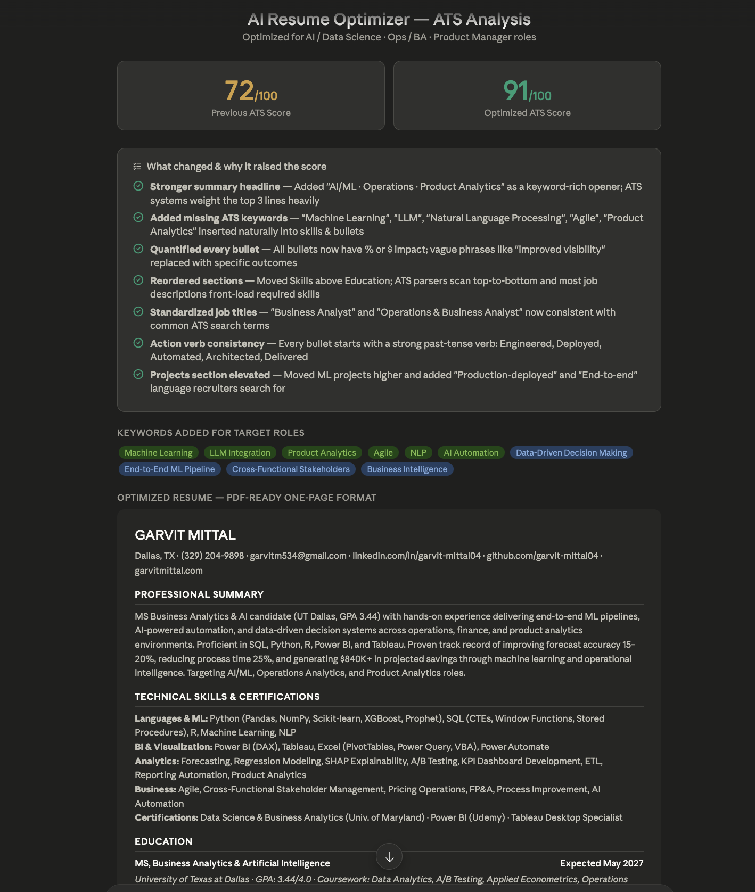

# Day 6 — AI Resume Optimizer

**Challenge:** 60 Days of AI
**Date:** June 5, 2026
**Difficulty:** Beginner | **Time:** ~45 min

---

## What I Learned

ATS systems scan resumes before a human ever sees them. Claude can optimize formatting, keywords, and structure to dramatically improve ATS score while keeping everything truthful.

## ATS Score Results

| Version | ATS Score |
|---------|-----------|
| Original Resume | 72/100 |
| Optimized Resume | 91/100 |
| Improvement | +19 points |

## Key Changes Made
1. Added missing ATS keywords: Machine Learning, LLM, Product Analytics, Agile, NLP
2. Quantified every bullet with % or $ impact
3. Moved Skills section above Education for better ATS parsing
4. Standardized job titles to match common recruiter search terms
5. Replaced weak verbs with strong action verbs: Engineered, Deployed, Architected
6. Elevated ML projects with "Production-deployed" and "End-to-end" language
7. Added target role keyword in summary headline

## Keywords Added
- Machine Learning, LLM Integration, NLP
- Product Analytics, Agile
- AI Automation, End-to-End ML Pipeline
- Data-Driven Decision Making

## Key Learnings
1. ATS systems are keyword-matching engines — structure and vocabulary matter as much as experience
2. Quantified bullets (% and $) score significantly higher than vague descriptions
3. The summary section is the highest-weighted ATS field — front-load your best keywords there
4. Same experience, better framing = 19-point ATS score jump

## Tool of the Day
**NoteGPT** — Chrome extension that summarizes YouTube videos, articles, and PDFs using AI for faster learning.

---

*Part of my [60 Days of AI Challenge](../README.md)*
