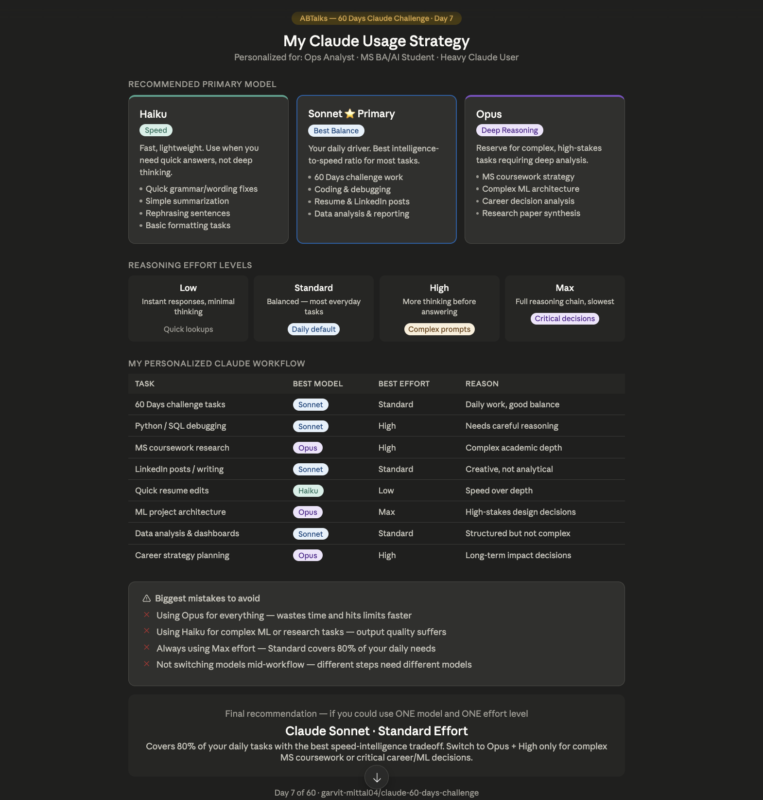

# Day 7 — Claude Model Selection & Reasoning Effort

**Challenge:** 60 Days of AI
**Date:** June 6, 2026
**Difficulty:** Beginner | **Time:** ~30 min

---

## What I Learned

Claude offers different models optimized for different types of work. Choosing the right model before writing a prompt is just as important as the prompt itself.

## My Profile
- **Situation:** Working Professional + MS BA/AI Student
- **Activities:** Coding, Learning, Research, Career Prep, Data Analysis
- **Usage:** Heavy User (daily)
- **Output needs:** Coding Help + Learning Support + Deep Research + Business Strategy

## Model Breakdown

| Model | Best For | When I Use It |
|-------|----------|---------------|
| Haiku | Speed, simple tasks | Quick edits, summarization |
| Sonnet ⭐ | Daily work, balance | 60 Days tasks, coding, writing |
| Opus | Deep reasoning | MS coursework, ML architecture |

## Reasoning Effort Guide

| Effort | Use When |
|--------|----------|
| Low | Quick lookups, simple rewrites |
| Standard | 80% of daily tasks |
| High | Complex prompts, debugging |
| Max | Critical career or ML decisions |

## My Personalized Claude Workflow

| Task | Model | Effort |
|------|-------|--------|
| 60 Days challenge | Sonnet | Standard |
| Python/SQL debugging | Sonnet | High |
| MS coursework research | Opus | High |
| LinkedIn posts | Sonnet | Standard |
| Quick resume edits | Haiku | Low |
| ML project architecture | Opus | Max |
| Career strategy planning | Opus | High |

## Biggest Mistakes to Avoid
1. Using Opus for everything — wastes time and hits limits
2. Using Haiku for complex tasks — quality suffers
3. Always using Max effort — Standard covers 80% of needs
4. Not switching models mid-workflow

## Final Recommendation
**Sonnet + Standard Effort** for 80% of work. Switch to Opus + High only for complex MS or ML decisions.

## Tool of the Day
**Claude Counter** — Browser extension to monitor Claude usage, message limits, and consumption in real-time.

---

*Part of my [60 Days of AI Challenge](../README.md)*
